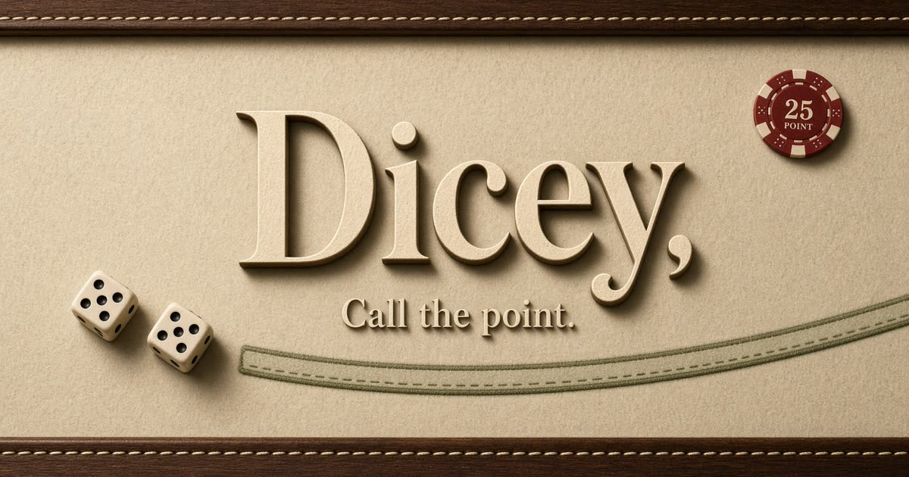

# Dicey

Craps table advisor. Call the point. Play the green.



Dicey is a phone-first table you can actually use while standing at a real craps layout. Set your bank, say or tap the number when the puck goes ON, and it paints which bets look promising — then sizes a ticket against the money you walked up with.

It never assumes you booked the ticket.

## At the table

1. **Tap the flap-clock bank** and enter what you actually have.
2. Pick a side: **Pass** or **Don't Pass**.
3. Pick a mood: **Earth Tone**, **Whiskey**, or **Dicey**.
4. When the shooter sets a number, **say it** (“six”, “yo” won’t set a point — points are 4, 5, 6, 8, 9, 10) or tap it on the pad / layout.
5. Read **Bet this**. Dollar-Bill spots are the ones to consider. Velvet is the trap. A combo tour flashes each recommended seat — solid Dollar Bill, then that bet’s own risk/reward color — and keeps looping until you call a new number.

Come-out stays quiet. The puck is off; Dicey waits.

Chip amounts scale with the bank and the mode (about 1% / 2% / 4.5% per unit). Use **×** on the ticket if you want the whole package louder or quieter. A quiet reminder to update the bank shows up if the point has been on a while — because people press, pull, and forget.

## Color

| You see | It means |
| --- | --- |
| **Dollar Bill** `#6B8068` | Promising. More saturated as the payoff multiplier climbs. |
| **Multiply fade** against cream felt `#EFE8D4` | Same bet, more variance — riskier, so it goes translucent. |
| **Velvet** `#7A1B2B` | Unpromising. Proposition bets stay velvet once the puck is on. |

The mascot is a winking die. Tap it. It shakes.

## What “promising” actually is

Not vibes. Not “the six is due.”

Every bet is scored from **pure single-throw probability** (36 equally likely faces). That expected value and variance are scaled to **100,000 independent rolls** starting from a bank of **1**. Across all those bets, points, and representative combinations, Dicey takes the **mean ending bank** and its **standard deviation**, then draws three lines:

| Mode | Lights a bet when |
| --- | --- |
| **Earth Tone** | Ending bank ≥ mean − ½ SD. Wider net, smaller units. |
| **Whiskey** | Ending bank ≥ the mean. House blend. |
| **Dicey** | The bet’s own upside (mean + ½ of *its* SD) reaches the mean. Chases the right tail. |

Recommended tickets are complementary layouts (odds, place 6/8, a come, a hardway when the mood is Dicey) — not a single EV-max chip dumped on one square.

The house still has an edge. Green is *relative*. Dicey ranks the layout. It does not print money.

## Run

Needs Node 20+.

```bash
git clone https://github.com/TheHairySeaCow/dicey.git
cd dicey
npm install
npm run dev
```

Then open [http://localhost:8080](http://localhost:8080). Voice needs a browser that implements the Web Speech API (Chromium and Safari).

```bash
npm run typecheck
npm run build
```

Bank, mode, and line persist in `localStorage`. Nothing is uploaded. There is no account.

## Keys

| Key | Action |
| --- | --- |
| `4` `5` `6` `8` `9` | Set that point |
| `0` | Point 10 |
| `Esc` or `C` | Puck off (come-out) |

## Stack

TanStack Start, React 19, Tailwind v4, Zustand. Math lives in `src/lib/craps/`. The table is `src/components/craps/`.

Built by [Grok](https://grok.com), xAI.
